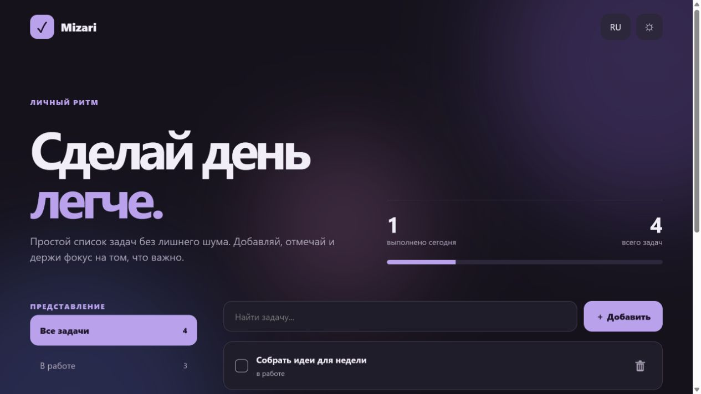

<div align="center">
  

  # Mizari Tasklist

  **Минималистичный менеджер задач для спокойной и сфокусированной работы**

  <p>
    
    
    
  </p>

  [Открыть приложение](https://mizioooz.github.io/Mizari-Tasklist/) ·
  [Портфолио Dizarizago](https://github.com/mizioooz/Dizarizago-Portfolio)
</div>

---



## О проекте

`Mizari Tasklist` — адаптивное веб-приложение для управления повседневными задачами. Интерфейс сохраняет визуальный фокус, не перегружает пользователя и одинаково удобно работает на компьютере и телефоне.

## Возможности

<table>
  <tr>
    <td width="50%"><strong>Управление задачами</strong><br><br>Добавление, завершение, удаление и быстрый поиск.</td>
    <td width="50%"><strong>Умные фильтры</strong><br><br>Просмотр всех, активных и выполненных задач.</td>
  </tr>
  <tr>
    <td><strong>Персонализация</strong><br><br>Светлая и тёмная темы, переключение языка.</td>
    <td><strong>Локальные данные</strong><br><br>Список сохраняется непосредственно в браузере пользователя.</td>
  </tr>
</table>

## Технологии

`HTML5` · `CSS3` · `JavaScript` · `LocalStorage` · `Responsive Design`

## Локальный запуск

Сборка и установка зависимостей не требуются:

```bash
git clone https://github.com/mizioooz/Mizari-Tasklist.git
cd Mizari-Tasklist
python -m http.server 8000
```

После запуска откройте `http://localhost:8000`.

## Структура

```text
Mizari-Tasklist/
├── docs/
│   ├── dizarizago-mark.svg
│   └── preview.png
├── index.html
└── README.md
```

## Контакты

<div align="center">
  <a href="https://github.com/mizioooz"></a>
  <a href="https://t.me/ss_dizarizago"></a>
  <a href="mailto:dizarizago@mail.ru"></a>
  <a href="https://vk.ru/ssdizarizago"></a>
</div>

---

<div align="center">
  <sub>Дизайн и разработка — Dizarizago</sub>
</div>
